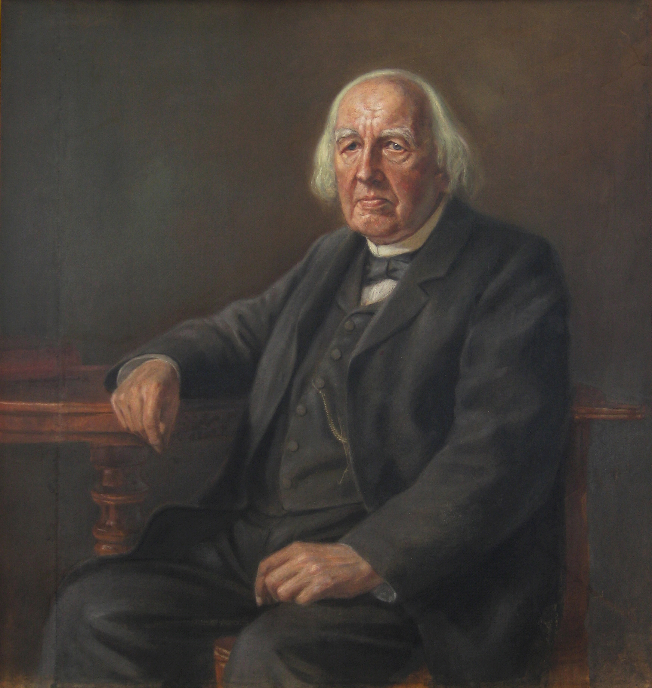

## 1. Introduction: The Seduction of Smoothness

Walk into any high school calculus classroom around the world, and you will hear a phrase repeated like a sacred mantra: 

> *"A function is differentiable at a point if you can draw its graph without lifting your pen—and without any sharp corners."*

This definition, borrowed almost verbatim from the chapter on continuity, is then reinforced day after day with a parade of friendly polynomials like $f(x) = x^2$, gentle sinusoids like $f(x) = \sin x$, and the occasional rational function with a single vertical asymptote. 

The absolute value function $f(x) = |x|$ is trotted out as the sole cautionary tale—the one "bad" function with a corner at zero, offered up like a scapegoat so that all other functions may be declared innocent. The implicit message is unmistakable: **the world of functions is, with negligible exceptions, a smooth and well-behaved place where tangents exist at every reasonable point.**

But here is the uncomfortable question that generations of calculus students have been subtly discouraged from asking: **Why do we believe this?** Why does the human mind so naturally, so unthinkingly, equate continuity with smoothness, and smoothness with differentiability? 

The answer, as we shall see, is not purely mathematical—it is physical, historical, and deeply psychological. Our intuition was not born in the sterile pages of a textbook; it was born in the silent orbit of planets, the graceful arc of a cannonball, the rhythmic swing of a pendulum, and the gentle ripple of water. We believe in smoothness because we live in a world that, at the scale of human experience, is overwhelmingly smooth.


## 2. The Physical Roots of Smoothness

To understand why the "smoothness intuition" became so deeply entrenched, we must go back not to the invention of calculus itself, but to the century that preceded it. The scientific revolution of the 17th century, spearheaded by figures like Galileo Galilei and Johannes Kepler, fundamentally transformed how humanity understood motion. 

::: {#fig-pioneers fig-align="center"}


{fig-align="center" width="30%"}
The pioneers.
:::

* **Galileo's experiments** with rolling balls down inclined planes revealed that the distance traveled was proportional to the square of time—a beautifully smooth quadratic relationship. 

::: {#fig-pioneers fig-align="center"}


{fig-align="center" width="30%"}
The pioneers.
:::

* **Kepler's laws of planetary motion**, derived from Tycho Brahe's meticulous astronomical observations, described the orbits of planets as smooth ellipses, with no jumps, no corners, and no discontinuities.


This was the intellectual atmosphere into which Isaac Newton was born. When Newton turned his attention to the problem of motion, he inherited a worldview in which the universe was governed by smooth, continuous laws. His own monumental work, the *Philosophiæ Naturalis Principia Mathematica* (1687), codified this vision. Newton's law of universal gravitation:

$$F = \frac{G m_1 m_2}{r^2}$$

is itself a smooth function everywhere except at the singular point $r = 0$, which physics conveniently excludes. The trajectories it produces—ellipses, parabolas, hyperbolas—are all smooth curves. In Newton's universe, nothing jumps. Nothing stutters. **Everything flows.**

When Newton invented the derivative—which he called the **"fluxion,"** literally a rate of flow—he was not inventing an abstract mathematical operation. He was describing the instantaneous velocity of a moving body. For Newton, every variable was a quantity flowing through time, and the derivative was its velocity at each instant. In such a physical framework, the idea of a function that jitters violently at every point was not merely improbable; it was physically nonsensical. Motion, by its very nature, must be smooth.


## 3. Leibniz and the Geometry of Infinitesimals

Across the English Channel, Gottfried Wilhelm Leibniz approached calculus from a different angle—but arrived at the same conclusion. Leibniz was a geometer at heart. His derivative was conceived not as a physical velocity but as the slope of a tangent line to a curve. To compute this slope, Leibniz introduced the idea of infinitesimals—infinitely small quantities denoted $dx$ and $dy$. The derivative $\frac{dy}{dx}$ was simply the ratio of these two infinitesimal changes.

::: {#fig-leibniz-panel}

{fig-align="center" width="30%"}


:::

Leibniz imagined that any curve, when examined under an infinitely powerful microscope, would reveal itself to be composed of infinitely many infinitesimal straight segments. The tangent line at a point was simply the straight line that coincided with the curve over an infinitesimal interval. 

> **The "Zoom In" Assumption:** If you look closely enough, every continuous curve becomes indistinguishable from a straight line. 

This assumption was not a theorem—it was an article of faith, a foundational postulate that made calculus work. And because it worked so brilliantly in practice, no one saw any reason to question it.

::: {#fig-leibniz-panel}


{fig-align="center" width="80%"}

Leibniz and his revolutionary calculus notations.
:::

One of Leibniz's most significant contributions to mathematics was his notation. The symbol $\frac{dy}{dx}$ is not merely a convenience—it is a **cognitive trap**. Its very form implies that the ratio always exists, that the quotient of two infinitesimals is a well-defined number at every point. Generations of students would internalize this notation without ever questioning the hidden assumption buried within it: that the denominator $dx$ can always be divided into the numerator $dy$, and that the slope is always finite and well-defined. The notation itself became a silent accomplice in the maintenance of the smoothness illusion.


## 4. The 18th Century: When Faith Became Dogma

The 18th century was the age of Enlightenment, and in mathematics, it was the age of analysis. Leonhard Euler, perhaps the most prolific mathematician in history, pushed calculus to astonishing new heights. He solved celestial mechanics problems, derived the Euler-Lagrange equations, and gave us the exponential function $e^x$ and the beautiful identity:

$$e^{i\pi} + 1 = 0$$

Every function Euler encountered was smooth. Every differential equation he solved had nice, well-behaved solutions. The evidence in favor of universal differentiability was overwhelming.

But there was a subtle problem: Euler and his contemporaries did not actually have a rigorous definition of a *function*. To Euler, a function was any expression constructed from variables and constants using algebraic operations, exponentials, logarithms, and trigonometric functions. In other words, **functions were formulas**. 

And formulas, by their algebraic nature, are built from elementary building blocks that are smooth wherever they are defined. The very definition of "function" in the 18th century excluded the possibility of the monsters that would later haunt mathematics. It was a victim of its own success—the tools were so powerful that no one noticed the logical gaps beneath their feet.

Jean le Rond d'Alembert, another giant of 18th-century mathematics, wrote that *"the calculus is the science of continuous quantities"* and took it for granted that continuous functions were precisely those that could be represented by a single analytic expression. The circle of reasoning was closed: continuity meant smoothness, smoothness meant differentiability, and differentiability meant calculus worked.


## 5. Why No One Questioned It

This is the question that haunts the historian of mathematics: How could brilliant minds across two centuries—Newton, Leibniz, Bernoulli, Euler, d'Alembert, Lagrange—all have accepted an assumption that we now know to be spectacularly false? The answer has three parts:

1. **The Available Examples Supported It:** Every function they had ever seen was differentiable almost everywhere. When your entire sample space consists of smooth functions, the generalization to "all functions are smooth" is the most natural inference one could make.
2. **The Technology Did Not Exist:** The construction of a nowhere-differentiable continuous function requires infinite series—a mathematical tool that was not fully understood until the 19th century. You cannot disprove a theorem that has not been precisely stated.
3. **The Physical World Gave No Hint:** Even today, nowhere-differentiable functions do not appear in the macroscopic physical world. Brownian motion, fractal coastlines, and stock market fluctuations are microscopic or emergent phenomena that 18th-century scientists could not observe. Their intuition was perfectly adapted to the world they inhabited.


## 6. The Calm Before the Storm

By the early 19th century, the assumption that continuity implied differentiability had been repeated so often and by so many authorities that it had ceased to be an assumption at all. It had become an article of faith, a mathematical truism that required no proof. 

The French mathematician André-Marie Ampère, famous today for his work in electromagnetism, would soon attempt to provide a rigorous proof of this "obvious" fact—a proof that would turn out to be flawed, but whose very existence testifies to how deeply entrenched the belief had become.

And then, in 1872, a quiet German mathematician named **Karl Weierstrass** walked into the Berlin Academy and detonated a bomb that would reverberate through the halls of mathematics for generations. He had constructed a function that was continuous everywhere but differentiable nowhere. The smooth universe was a lie. The monsters were real.

And that, as they say, is where our story truly begins.


## 7. The Anatomy of a Mathematical Nightmare (The Conceptual & Structural Blend)

The function that Weierstrass presented that day was not just a mathematical curiosity—it was a declaration of war against two centuries of complacency. 
It shattered the intuition that Newton and Leibniz had built, the intuition that Euler had taken for granted, the intuition that every calculus student since has been taught. 

How did such a monster come to be? What did it look like? And why did the greatest mathematicians of the era recoil from it in horror? For the answers to these questions, we turn to the most terrifying show in the history of calculus.

### The Great Deception of Smoothness
For centuries, the titans of mathematics—Newton, Leibniz, Euler, and Gauss—shared a foundational, almost religious assumption: **nature is smooth.** This belief was codified in the geometric principle of *local linearity*. 

The core promise of calculus was that if you zoom in closely enough on any continuous curve, the curvature will eventually evaporate. Under a powerful enough mathematical microscope, the most chaotic bend flattens out into a predictable, straight line. This line is the tangent, and its slope is the derivative. To be continuous meant you were predictable at a microscopic scale. Calculus was the ultimate tool for turning the chaotic, curved universe into a collection of neat, linear steps.

::: {#fig-weierstrass-panel}

{fig-align="center" width="30%"}


:::


### Weierstrass’s Microscopic Meat Grinder
In 1872, Karl Weierstrass did not just break this promise; he vaporized it. He constructed a completely unbroken function; you can trace it from negative infinity to positive infinity without ever lifting your pen, yet it is entirely devoid of derivatives.

To understand the horror of the Weierstrass function, you have to imagine looking at it through a microscope:

> Suppose you choose a single point and begin to zoom in, expecting the curve to flatten out into a friendly tangent line. Instead, the single line splits into a jagged mountain peak. You zoom in further, thinking you can flatten out the tip of that peak. Instead, the tip erupts into an entire mountain range of even smaller, sharper spikes.

No matter how deep you go, even if you zoom in by a factor of a trillion, the curve never straightens. It is made entirely of microscopic, non-stop sharp corners. Because it never flattens out, you can never establish a stable "direction" at any single point. There is not a single millimeter of smooth ground to lay down a tangent line. Weierstrass had engineered a geometric monster: **an infinitely jagged, self-similar fractal coastline that defies the very concept of scale.**

```{python}
#| label: fig-weierstrass-horror
#| fig-cap: "The Geometrical Nightmare: Witness the Weierstrass function defying the 'local linearity' promise. Notice how as we zoom in (top right to bottom right), the curve *never* becomes a straight line; instead, every peak erupts into a new mountain range of sharper peaks, *ad infinitum*."
#| fig-align: "center"
import numpy as np
import matplotlib.pyplot as plt

# --- Define the Weierstrass Function ---
# f(x) = sum(n=0 to N) [a^n * cos(b^n * pi * x)]
def weierstrass(x, a, b, N=50):
    f_x = np.zeros_like(x)
    for n in range(N):
        term = (a**n) * np.cos((b**n) * np.pi * x)
        f_x += term
    return f_x

# --- Parameters ---
a = 0.5   # Decay rate of amplitude (0 < a < 1)
b = 3.0   # Scale rate of frequency (b is an integer > 1/a)
x = np.linspace(-1, 1, 10000)
f_x = weierstrass(x, a, b)

# --- Define Zoom Views ---
zoom_ranges = [(-1.0, 1.0), (-0.1, 0.1), (-0.01, 0.01), (-0.001, 0.001)]

# --- Set up the Figure layout ---
fig, axs = plt.subplots(2, 2, figsize=(12, 10), constrained_layout=True)
fig.suptitle('The Weierstrass Monster: Smooth everywhere, differentiable nowhere.', fontsize=18)

# --- Plot Global and Zoomed Views ---
for idx, (ax, current_range) in enumerate(zip(axs.flat, zoom_ranges)):
    x_current = np.linspace(current_range[0], current_range[1], 10000)
    f_current = weierstrass(x_current, a, b)
    
    ax.plot(x_current, f_current, color='#0e33ea', lw=1) # A light gray/silver color for a 'metallic nightmare' look
    ax.set_title(f"Global View [-1, 1]" if idx==0 else f"Zoom Factor {10**idx}x", fontsize=14)
    ax.set_xlim(current_range)
    # Automatic y-limit adjust based on data
    ax.set_ylim([f_current.min(), f_current.max()])
    ax.grid(True, linestyle='--', color='gray', alpha=0.5)

plt.show()
```

### The Physics of Impossible Motion
The geometric impossibility of the Weierstrass function translates into an even more terrifying physical paradox. In classical physics, a derivative isn't just a slope; it is **instantaneous velocity**. If you plot an object's position over time, the derivative tells you how fast it is moving at an exact, frozen split-second.

If a particle were to travel along a path dictated by the Weierstrass function, its journey would be continuous, meaning it exists at every moment in time, traveling from `Point A` to `Point B` without teleporting. However, because the function is differentiable nowhere, **the particle has no measurable speed or direction at any point in its journey.** To have a defined velocity, your change in position over an infinitely small interval of time must stabilize into a single, predictable number. But on this curve, the particle is experiencing infinite, violent agitation at every microscopic tick of the clock. It is jerking left, right, up, and down infinitely fast, all at the exact same time. If you looked at the particle's speedometer, the needle wouldn't just bounce—it would cease to exist. 

Weierstrass created a universe where an object can be actively moving, yet its speed is mathematically undefinable. It is motion stripped of its predictability, a kinematic ghost story.